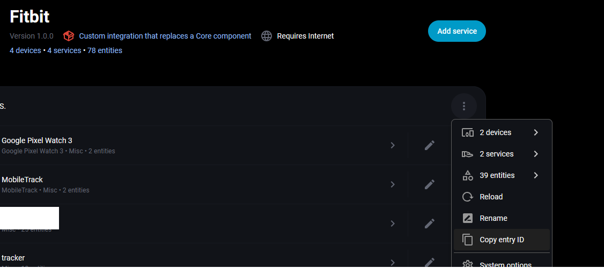
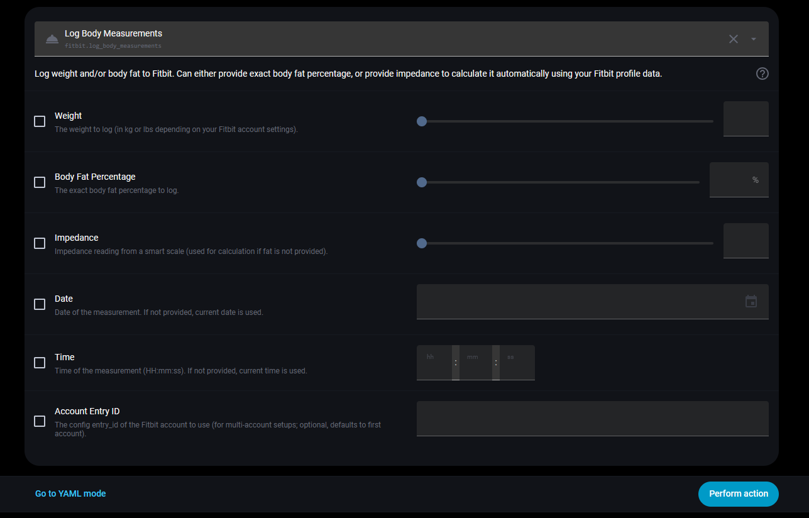

# Fitbit Custom for Home Assistant


A custom component for Home Assistant that **overrides and replaces the default core Fitbit integration**. Fitbit Custom provides all the features of the official integration, plus advanced capabilities such as logging body measurements (weight and body fat percentage) directly from Home Assistant.

**This component is fully HACS-compliant and acts as a drop-in replacement for the core Fitbit integration.**

---

## Important: Migrating from the Core Fitbit Integration

If you are already using the built-in Fitbit integration in Home Assistant, you must **delete the existing Fitbit integration/connection** from Home Assistant before setting up Fitbit Custom. This is required because only one Fitbit integration can be active at a time.

**Update your Fitbit Developer App Permissions:**

1. Go to [Fitbit Developer Apps](https://dev.fitbit.com/apps) and log in.
2. Find your existing app used for Home Assistant and click to edit it.
3. Change the permissions from **Read Only** to **Read & Write** (this is required for logging measurements).
4. Save the changes.

You do **not** need to create a new app if you already have one—just update the permissions as above.


## Features

- **Everything from the Core Integration**: Provides sensors for your daily activity (steps, distance, calories, sleep, battery, etc.).
- **Log Body Measurements**: A unified `fitbit.log_body_measurements` action to easily record weight and body fat.
- **Smart Body Fat Calculation**: If you only have raw `impedance` and `weight` readings (like from a smart scale), this integration automatically queries your Fitbit user profile for your `height`, `date_of_birth`, and `gender` to calculate your body fat percentage accurately before logging it!


## Acknowledgements


This custom component is built directly upon the official [Home Assistant Fitbit Integration](https://github.com/home-assistant/core/tree/dev/homeassistant/components/fitbit). Full credit goes to the Home Assistant core team and the original contributors (specially [@allenporter](https://github.com/allenporter)) for their exceptional work building the integration.


## Installation

### Method 1: HACS (Recommended)
1. Open Home Assistant and navigate to **HACS**.
2. Click the three dots in the top right corner and select **Custom repositories**.
3. Add the URL of this repository: `https://github.com/vinodmishra/ha-fitbit-custom`
4. Select the category **Integration**.
5. Click **Add** and then download the newly available **Fitbit Custom** integration.
6. Restart Home Assistant.

### Method 2: Manual
1. Download or clone this repository.
2. Copy the `custom_components/fitbit` directory to your `custom_components` directory in your Home Assistant configuration folder.
3. Restart Home Assistant.


## Configuration & Setup


You need to register a personal application on the Fitbit Developer site to obtain an OAuth Client ID and Secret. If you already have an app, just update its permissions as described above.

1. Go to the [Fitbit App Registration page](https://dev.fitbit.com/apps/new) and log in (or edit your existing app at [Fitbit Developer Apps](https://dev.fitbit.com/apps)).
2. Fill out the application details as follows:
   - **Application Name**: Home Assistant (or anything you prefer)
   - **Description**: Home Assistant Integration
   - **Application Website URL**: `https://www.home-assistant.io/`
   - **Organization**: Home Assistant
   - **Organization Website URL**: `https://www.home-assistant.io/`
   - **Terms of Service URL**: `https://www.home-assistant.io/`
   - **Privacy Policy URL**: `https://www.home-assistant.io/`
   - **OAuth 2.0 Application Type**: `Personal`
   - **Callback URL**: `https://my.home-assistant.io/redirect/oauth`
  - **Default Access Type**: `Read & Write` *(Crucial: Must be Read & Write so you can log measurements)*
3. Check the box to agree to the Terms of Service and click **Register**.
4. You will now see your **OAuth 2.0 Client ID** and **Client Secret**. Keep this page open.
5. In Home Assistant, navigate to **Settings -> Devices & Services -> Add Integration**.
6. Search for **Fitbit Custom** and select it.
7. Enter your **OAuth Client ID** and **Client Secret** when prompted, and complete the authorization flow in your browser.


## Logging Body Measurements: Blueprint or Manual Action

You can log weight and body composition data to Fitbit in two ways:

- **Use the included Home Assistant blueprint** for easy, automated logging from your smart scale sensors (recommended for most users).
- **Call the `fitbit.log_body_measurements` action directly** in your own automations or scripts (see documentation below).

### Quick Start: Add the Blueprint

[](https://my.home-assistant.io/redirect/blueprint_import/?blueprint_url=https://github.com/vinodmishra/ha-fitbit-custom/blob/main/blueprints/fitbit_body_scale_logger.yaml)

Or, manually import the blueprint from this repo:
- Go to **Settings > Automations & Scenes > Blueprints** in Home Assistant.
- Click **Import Blueprint** and paste the url: `https://github.com/vinodmishra/ha-fitbit-custom/blob/main/blueprints/fitbit_body_scale_logger.yaml`

**Features:**
- Logs weight, body fat %, and impedance to Fitbit.
- Supports minimum/maximum weight thresholds for filtering.
- Multi-account support: select a Fitbit entity to automatically route data to the correct profile (no need to manually find entry_id).
- Optional sensors for body fat and impedance.

**Inputs:**
- **Weight Sensor (Required):** The sensor providing your weight/mass reading.
- **Fat Sensor (Optional):** The sensor providing body fat percentage.
- **Impedance Sensor (Optional):** The sensor providing impedance data.
- **Fitbit Target Profile (Optional):** Select any Fitbit sensor entity from the account you want to sync to. The blueprint extracts the required entry ID automatically.
- **Minimum/Maximum Weight Thresholds (Optional):** Only sync if weight is within these bounds.

---

## Using the `log_body_measurements` Action

You can find the `fitbit.log_body_measurements` action in your Home Assistant Developer Tools or use it in automations.

### Example: Log weight and exact body fat percentage
```yaml
action: fitbit.log_body_measurements
data:
  weight: 75.5
  fat: 15.2
```

### Example: Log weight and calculate body fat via impedance
```yaml
action: fitbit.log_body_measurements
data:
  weight: 75.5
  impedance: 505
```
*Note: The integration will automatically fetch your gender, height, and age from your Fitbit profile to perform the calculation!*

## Selecting a Specific Fitbit Account (Multi-Account Support)

> **Note:** To use multiple Fitbit accounts with this integration, your Fitbit developer app must be created with **OAuth 2.0 Application Type** set to `Server`, not `Personal`. The `Personal` type only allows a single account connection. If you need to support multiple accounts, create a new app or edit your existing app and change the Application Type to `Server`.

If you have multiple Fitbit accounts configured, you can now select which account to use when logging body measurements by specifying the `entry_id` in the service call.

### How to Find the entry_id

1. Go to **Settings > Devices & Services** in Home Assistant.
2. Click on the three dots (⋮) for the Fitbit integration you want to use.
3. Select **System Options** or **Show Info** (depending on your Home Assistant version).
4. Copy the `entry_id` value as shown below:



### Example: Log weight for a specific account
```yaml
action: fitbit.log_body_measurements
data:
  weight: 75.5
  entry_id: "your_entry_id_here"
```

### New Service Action in Developer Tools

You will see the new `entry_id` field available when calling the service in Home Assistant Developer Tools:


